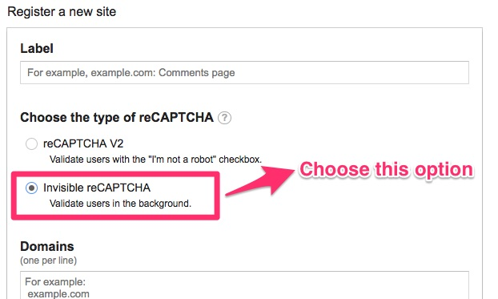

Laravel Invisible reCAPTCHA
==========

[](https://packagist.org/packages/spaanproductions/invisible-recaptcha)

## Why Invisible reCAPTCHA?

Invisible reCAPTCHA is an improved version of reCAPTCHA v2(no captcha).
In reCAPTCHA v2, users need to click the button: "I'm not a robot" to prove they are human. In invisible reCAPTCHA, there will be not embed a captcha box for users to click. It's totally invisible! Only the badge will show on the buttom of the page to hint users that your website is using this technology. (The badge could be hidden, but not suggested.)

## Notice

* The master branch doesn't support multi captchas feature. (**Most of the time you are misusing recaptcha when you try to put multiple captchas in one page.**)

## Installation

```
composer require spaanproductions/invisible-recaptcha
```

## Laravel 10

### Setup

It has auto discover for the provider. No need to add it manually. 

### Configuration
Before you set your config, remember to choose `invisible reCAPTCHA` while applying for keys.


Add `INVISIBLE_RECAPTCHA_SITEKEY`, `INVISIBLE_RECAPTCHA_SECRETKEY` to **.env** file.

```
// required
INVISIBLE_RECAPTCHA_SITEKEY={siteKey}
INVISIBLE_RECAPTCHA_SECRETKEY={secretKey}

// optional
INVISIBLE_RECAPTCHA_BADGEHIDE=true
INVISIBLE_RECAPTCHA_DATABADGE="bottomright"
INVISIBLE_RECAPTCHA_TIMEOUT=5
INVISIBLE_RECAPTCHA_DEBUG=false
```

> There are three different captcha styles you can set: `bottomright`, `bottomleft`, `inline`

> If you set `INVISIBLE_RECAPTCHA_BADGEHIDE` to false, you can show the badge logo.

> You can see the binding status of those catcha elements on browser console by setting `INVISIBLE_RECAPTCHA_DEBUG` as true.

### Usage

Before you render the captcha, please keep those notices in mind:

* `render()` or `renderHTML()` function needs to be called within a form element.
* You have to ensure the `type` attribute of your submit button has to be `submit`.
* There can only be one submit button in your form.

##### Display reCAPTCHA in Your View

```php
{!! app('captcha')->render() !!}

// or you can use this in blade
@captcha
```

With custom language support:

```php
{!! app('captcha')->render('en') !!}

// or you can use this in blade
@captcha('en')
```
##### Validation

Add `'g-recaptcha-response' => 'required|captcha'` to rules array.

```php
$validate = Validator::make(Input::all(), [
    'g-recaptcha-response' => 'required|captcha'
]);
```

## Credits 

* anhskohbo (the author of no-captcha package)
* albertcht (the original author of the laravel invisible-recaptcha package https://github.com/albertcht/invisible-recaptcha)
* [Contributors](https://github.com/spaanproductions/invisible-recaptcha/graphs/contributors)
